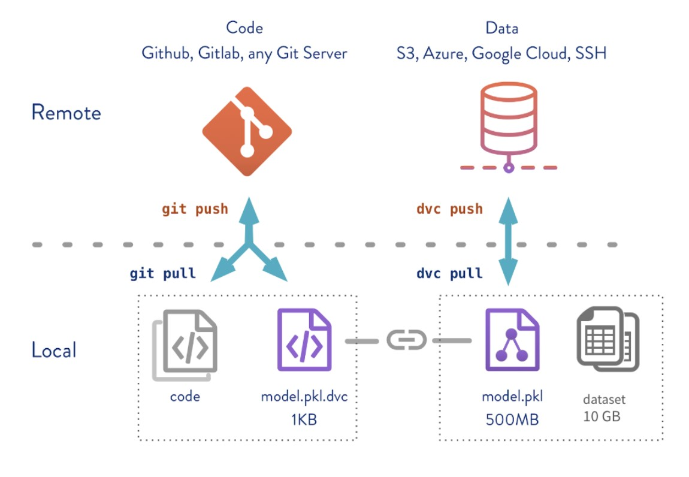

# MLOps

- Taking machine learning models to production, then maintaining & monitoring them.

- You should have _Microsoft VSCode_ and _Docker Desktop_ installed and running in your local machine. To install Docker Desktop, follow Docker Installation guidelines for your operating system.

## Table of contents

- [MLOps](#mlops)
  - [Table of contents](#table-of-contents)
  - [MLOps Workflow](#mlops-workflow)
  - [Coding Guidelines](#coding-guidelines)
  - [Git basics](#git-basics)
    - [Git Setup](#git-setup)
    - [Init](#init)
    - [Useful commands](#useful-commands)
  - [Pipeling in Machine Learning](#pipeling-in-machine-learning)
    - [General Steps](#general-steps)
    - [💡 Example of structuring `Jupyter Notebook Code` to a `.py` module](#-example-of-structuring-jupyter-notebook-code-to-a-py-module)
  - [DVC - Data Version Control](#dvc---data-version-control)
    - [Automating pipelines with DVC 🛠️](#automating-pipelines-with-dvc-️)
    - [Adding stages to DVC pipeline - `dvc add`](#adding-stages-to-dvc-pipeline---dvc-add)
    - [Running/Reproducing pipelines - `dvc repro`](#runningreproducing-pipelines---dvc-repro)
    - [Versioning data and models with DVC](#versioning-data-and-models-with-dvc)
    - [DVC commands - `dvc add`, `dvc push`, `dvc pull`](#dvc-commands---dvc-add-dvc-push-dvc-pull)
    - [Tracking changes \& switching between versions - `dvc status` \& `dvc checkout`](#tracking-changes--switching-between-versions---dvc-status--dvc-checkout)
    - [Data access in DVC - `dvc list`, `dvc get`, `dvc import`](#data-access-in-dvc---dvc-list-dvc-get-dvc-import)
  - [Hydra](#hydra)
  - [Weights and Biases](#weights-and-biases)

## MLOps Workflow

---

- Steps included in succesful creation of a MLOps project.

    1. Data Management and analysis.

    2. Experimentation

    3. Solution developement & Testing.

    4. Deployment & Serving.

    5. Monitoring & maintenance.

## Coding Guidelines

---

- Guidelines on writing codes for project.

    1. Organize code into clean, reusable units 🔧 - _functions_, _classes_ & _modules_. [💡](https://www.geeksforgeeks.org/python-oops-concepts/)

    2. Use __git__ for code versioning.

    3. Follow style guidelines: write _comments_, [_docstrings_](https://www.geeksforgeeks.org/python-docstrings/), [_type annotations_](https://docs.python.org/3/library/typing.html).

    4. Keep _requirements.txt_ and _Dockerfile_ updated.

    5. Testing

## Git basics

---

> You should have git setup and running on your local machine.

### Git Setup

Configurating user information used across

```bash
git config --global user.name "[firstname lastname]"
```

```bash
git config --global user.email ["valid-email"]
```

### Init

Initiallizing and cloning repositories

```bash
git init
```

```bash
git clone [url]
```

### Useful commands

1. Check current status

    ```bash
    git status
    ```

2. Add files for versioning and tracking

   ```bash
    git add <f_name>
    ```

3. Commit staged content

    ```bash
    git commit -m "[description]"
    ```

4. List all branches in git. A \* will appear after active branch.

    ```bash
    git branch
    ```

5. Switch to another branch and check it out to working directory.

    ```bash
    git checkout -b "[branch-name]"
    ```

6. Add a git URL

    ```bash
    git remote add "[alias]" <URL>
    ```

7. Fetch down all the branches from that Git remote.

    ```bash
    git fetch "[alias]"
    ```

8. Merge a remote brach into your current branch and bring it up-to-date.

    ```bash
    git merge "[alias]/[branch]"
    ```

9. Transmit local branch commits to the remote repository branch

    ```bash
    git push "[alias]" "[branch]"
    ```

10. Fetch and merge any commits from tracking remote branch

    ```bash
    git pull
    ```

## Project Organization

---

> We are going to use __PyScaffold Cookiecutter Data Science__ project template.

### PyScaffold Setup

---

1. Install PyScaffold

    ```bash
    pip install pyscaffoldext-cookiecutter
    ```

2. Install pre-commit

    ```bash
    pip install pre-commit
    ```

3. Initiallize an empty project with cookiecutter `data science` project structure

    ```bash
    putup --dsproject <Name of your project>
    ```

### Structure of project directory/repository

---

```text
├── AUTHORS.md              <- List of developers and maintainers.
├── CHANGELOG.md            <- Changelog to keep track of new features and fixes.
├── CONTRIBUTING.md         <- Guidelines for contributing to this project.
├── Dockerfile              <- Build a docker container with `docker build .`.
├── LICENSE.txt             <- License as chosen on the command-line.
├── README.md               <- The top-level README for developers.
├── configs                 <- Directory for configurations of model & application.
├── data
│   ├── external            <- Data from third party sources.
│   ├── interim             <- Intermediate data that has been transformed.
│   ├── processed           <- The final, canonical data sets for modeling.
│   └── raw                 <- The original, immutable data dump.
├── docs                    <- Directory for Sphinx documentation in rst or md.
├── environment.yml         <- The conda environment file for reproducibility.
├── models                  <- Trained and serialized models, model predictions,
│                              or model summaries.
├── notebooks               <- Jupyter notebooks. Naming convention is a number (for
│                              ordering), the creator's initials and a description,
│                              e.g. `1.0-fw-initial-data-exploration`.
├── pyproject.toml          <- Build configuration. Don't change! Use `pip install -e .`
│                              to install for development or to build `tox -e build`.
├── references              <- Data dictionaries, manuals, and all other materials.
├── reports                 <- Generated analysis as HTML, PDF, LaTeX, etc.
│   └── figures             <- Generated plots and figures for reports.
├── scripts                 <- Analysis and production scripts which import the
│                              actual PYTHON_PKG, e.g. train_model.
├── setup.cfg               <- Declarative configuration of your project.
├── setup.py                <- [DEPRECATED] Use `python setup.py develop` to install for
│                              development or `python setup.py bdist_wheel` to build.
├── src
│   └── classify_covid      <- Actual Python package where the main functionality goes.
├── tests                   <- Unit tests which can be run with `pytest`.
├── .coveragerc             <- Configuration for coverage reports of unit tests.
├── .isort.cfg              <- Configuration for git hook that sorts imports.
└── .pre-commit-config.yaml <- Configuration of pre-commit git hooks.
```

## Pipeling in Machine Learning

---

> Series of successive & sometimes parallel steps in which we process data.

### General Steps

1. Extracting, transforming and loading data.

2. Creating a test/train split.

3. Model Training

4. Model Evaluation

- Example: Suppose that you have 2 parameter settings - _Epoch = 10 & 20_. You would probably want to run steps 1 & 2 only once for both setting, and 3 & 4 twice for each setting. Having a pipeline makes this work easy.

- Simple ML pipeline 🔧

    ```mermaid
    flowchart LR
    
    A(Load Data) --> B(Featurize)
    B --> C{Data Split}
    C -->|Train Data| D[Train Model]
    C -->|Test Data| E[Evaluate Model]
    
    ```

For making production ready projects, we need to convert `Jupyter Notebooks` into `.py` modules.

1. Makes versioning easy to automate & build pipelines.

2. Keep _parameters_ in a `config` file (_config.yaml_). We will use `Hydra.cc` in to load these configuration files. For example,

    ```yaml
    params:
        batch_size: 32
        learning_rate: 0.01
        training_epoch: 30
        num_gpus: 4
    ```

3. Keep more _reusable_ codes into `.py` modules. For e.g. Create `visualize.py` to contain visualization task.

4. Create `.py` modules for each computation task(_stage_).

5. Structure `.py` modules for run in both mode - _Jupyter_ & _Terminal_

### 💡 Example of structuring `Jupyter Notebook Code` to a `.py` module

- Converting dataset loading in jupyter notebook to a python script. _We will use hydra.cc for configuration load afterwards. Fow now, we are using yaml library._
- This example showcases use of `Argument Parser` to pass arguments to module from terminal.

    `dataset_load.py`

    ```python
    import typing
    import yaml
    import argparse

    def data_load(config_path: Text) -> None:
        cfg = yaml.safe_load(open(config_path))
        raw_data_path = cfg['data_load']['raw_data.path']
        ...
        ...
        data.to_csv(cfg['dataset_processed_path'])

    if __name__ == '__main__':
        args_parser = argparse.ArgumentParser()
        args_parser.add_argument('--config', dest = 'config', required = True)
        args = args_parser.parse_args()

        data_load(config_path = args.config)

    ```

- To import this function into _Jupyter Notebook_ : `from dataset_load import data_load` and pass the argument to the function.

- To run it from terminal, change directory to _root folder_ and execute : `python -m src.stages.data_load --config=params.yaml`

> To build a ML pipeline, create modeules for each stage like above. Then, run tose modules sequentially.

## [DVC](https://dvc.org/) - Data Version Control

---

DVC is an open source version control system for ML projects. It will be used for

1. __Experiment management__ - creating pipelines, tracking metrics, parameters and dependencies.

2. __Data Versioning__ - Versioning data as we version codes using git.

> Installing DVC - `pip install dvc[all]`

- Good to intregrate [logging](https://realpython.com/python-logging/).

> Initiallizing DVC - `dvc init` Creates a `.dvc` folder containing all information about the directory. You must add DVC under git control - `git add .` & `git commit -m "Init DVC"`

### Automating pipelines with DVC 🛠️

- Running [stages](#pipeling-in-machine-learning) in sequence manually might be cumbersome and a time taking process. DVC helps in organizing stages into pipeline.
- Stages might depend on parameters, outputs of other stages, and other dependencies. DVC helps in tracking all of them and runs only the stage where a change is detected. (💡Remember example of 2 possible epoch values?)
  
> DVC builds a dependency graph(Directed Acyclic Graph)of stages to determine the order of execution. It saves them in a `dvc.yaml` file. To check graph - `dvc dag`

### Adding stages to DVC pipeline - `dvc add`

To add a stage to DVC pipeline, execute the following command.

```bash
dvc stage add -n <name> \ # Name: Name of the stage of pipeline
    -d <dependencies> \   # Dependencies: files(to track) on which processing of stage depends.
    -o <outputs> \        # Outputs: outputs of stage. DVC tracks them for any external change.
    -p <parameters> \     # Parameters: parameters in the config file to track for changes.
        command           # Command to execute on execution of this stage of pipeline
```

Example : Adding [data_load.py](#-example-of-structuring-jupyter-notebook-code-to-a-py-module) module as a stage in DVC pipeline

```bash
dvc stage add -n data_load \
    -d src/data_load.py \
    -o data/iris.csv \
    -p data_load \
    python -m src.data_load --config=params.yaml
```

Structure of `dvc.yaml` file

```yaml
stages:
    stage1: #Name of stage
        cmd: <Commmand to execute>
        deps: <Dependencies>
        params: <Parameters>
        outs: <Outputs>
    ...
```

> You can manually add stages or make changes to stages in the `dvc.yaml` file.

### Running/Reproducing pipelines - `dvc repro`

After adding all stages to pipeline, execute:

```bash
dvc repro
git add .
git commit -m "Description"
```

DVC will run the pipeline and start to monitor all the parameters, dependencies and outputs specified. When you execute `dvc repro` for the next time:

1. If any stage dependency change is detected, DVC runs stages affected by this change. It won't run the unaffected stages.

2. Before running any stage, it deletes all outputs of the stage.

3. DVC follows downstream to produce other stages.

To reproduce __single stage__:

```bash
dvc repro -s <stage_name> # add -f for forced execution.,
```

### Versioning data and models with DVC

Need of data versioning:

1. Reproucible ML experiments require versioned data, models & artifacts.

2. Meet regulatory compliance & ethical AI requirements(e.g. Health & Finance).

3. Data processing takes a long time, resources are expensive, need to be deterministic and reproducile.

4. We need not produce same data repeatedly.

How data versioning works? - _reflinks_



> Use `git` to version code, `dvc` to version data.

### DVC commands - `dvc add`, `dvc push`, `dvc pull`

1. Add file/folder to DVC:

   ```bash
   dvc add <file/folder> # creates reflink to cache for file added
   ```

2. Setting up remote storage: Either create a local remote storage(dummy remote) or add S3, Gdrive, Blob, etc.

    ```bash
    dvc remote add -f "<name of remote>" </>
    ```

    __</>__ : <tmp/dvc> for local storage

    __</>__ : <gdrive/folder_id> for Google Drive

3. To push data to remote or pull from remote:

    ```bash
    dvc push/pull
    ```

### Tracking changes & switching between versions - `dvc status` & `dvc checkout`

1. To track status of staged files:

    ```bash
    dvc status # returns any changes made to files tracked by DVC
    ```

2. To switch version: (check: <https://dvc.org/doc/command-reference/checkout>)

    ```bash
    dvc checkout
    ```

### Data access in DVC - `dvc list`, `dvc get`, `dvc import`

1. To list project contents, including files, models, and directories tracked by DVC and by Git:

    ```bash
    dvc list "<URL>"
    ```

2. To download data, but not keeping track of changes with remote:

    ```bash
    dvc get "<URL>"
    ```

3. TO download data, and keep track of changes:

    ```bash
    dvc import "<URL>"
    ```

## [Hydra](https://hydra.cc/)

> Hydra is a configuration management framework for Machine Learning/ Data Science projects.
>
>Installing Hydra: `pip install hydra-core --upgrade`

You must have all configurations in a folder named __config__ as per our Pyscaffold Cookie-cutter DS template.

To import configuration to a python file:
1. Method 1: 
    ```python
    import hydra
    from omegaconf import DictConfig, OmegaConf

    @hydra.main(version_base=None, config_path="conf", config_name="config")
    def my_app(cfg : DictConfig) -> None:
        print(OmegaConf.to_yaml(cfg))

    if __name__ == "__main__":
        my_app()
    ```

2. Method 2:
   ```python
    from hydra import compose, initialize

    # Loading configuration file using Hydra
    initialize(version_base=None, config_path='../../configs')
    config = compose(config_name=config_name)
   ```

To use configuration: `config.<>.<>`


## [Weights and Biases](https://wandb.ai/)

> Experiment tracking utility for machine learning.
>
> Installing Wandb: pip install wandb

To Login:
1. Open wandb.ai > Settings > Danger Zone > API
   
2. Copy your API key.

3. Execute `wandb login` & paste your key.

You must be logged in to your Weights and Biases account now.

To start a new run:
```python
import wandb
wandb.init(project = '<Project_name>', config = config)
# Note that config has to be loaded using Hydra.cc before
# calling this command.
# This will upload training configurations to W&B portal.
```

Integration with __Keras__:
```python
# We use keras callback to integrate W&B with our model.
# This will log accuracy, AUR loss, GPU & CPU usage.
# Pass the callback to model.fit
model.fit(
  X_train,
  y_train,
  validation_data=(X_test, y_test),
  callbacks=[WandbCallback()]
)
```

To log any other metrics:
`wandb.log('parameter_name': parameter_value)`
